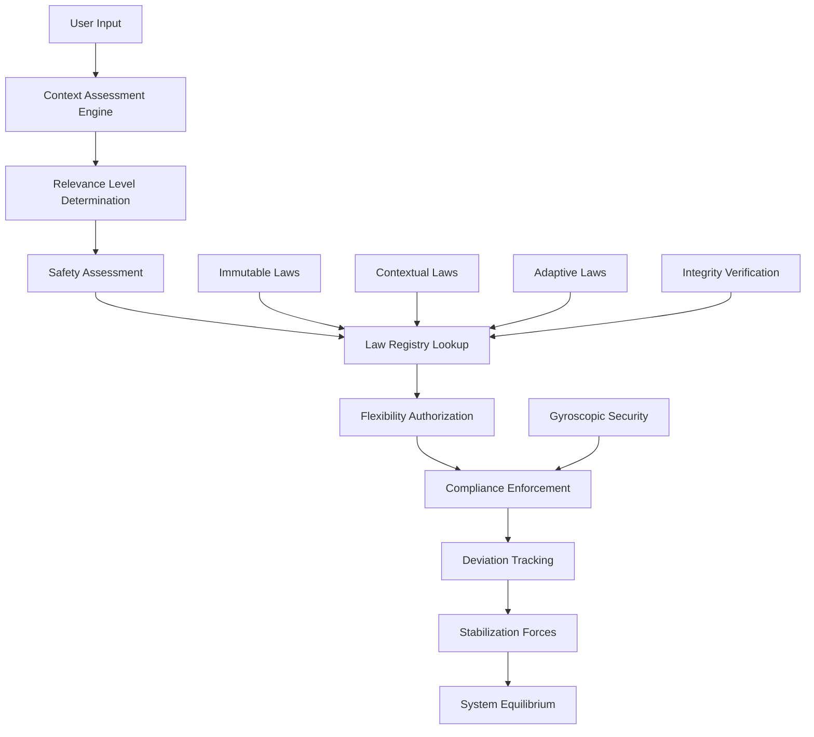

# Contextual Law Enforcement System
## The Implementation of "Relevance is King" with Guaranteed Stabilization

---

## 🎯 **Executive Summary**

The Contextual Law Enforcement System represents KIMERA's implementation of intelligent, context-aware rule application with guaranteed return to equilibrium. This system embodies the principle that **"relevance is king"** while ensuring system stability through automatic stabilization mechanisms.

### Key Features
- **Three-Tier Rule System**: Immutable, Contextual, and Adaptive flexibility levels
- **Relevance Assessment Engine**: AI-driven context analysis for optimal rule application
- **Gyroscopic Stabilization**: Automatic return to equilibrium after contextual deviations
- **Cryptographic Integrity**: Tamper-proof law registry with hash verification
- **Real-time Monitoring**: Continuous tracking of rule deviations and system stability

---

## 🏛️ **Architecture Overview**



---

## 📚 **Core Components**

### 1. Immutable Law Registry (`immutable_laws.py`)

The foundation of the system - a cryptographically protected registry of all behavioral rules.

#### Law Categories:
- **CORE**: Fundamental system principles (0% flexibility)
- **NEUTRALITY**: Bias prevention and equilibrium maintenance
- **SAFETY**: Harm prevention and truth commitment
- **COGNITIVE**: Humility and multi-perspective requirements
- **THERMODYNAMIC**: Entropy conservation principles

#### Flexibility Tiers:
- **IMMUTABLE**: 0% flexibility - Cannot be violated under any circumstances
- **CONTEXTUAL**: 30% base flexibility - Can be adjusted based on context relevance
- **ADAPTIVE**: 70% base flexibility - Highly responsive to user needs and context

#### Example Laws:
```python
L0: "Primacy of Contradiction" (IMMUTABLE)
    - May only act through contradiction-induced tension deformation
    
N1: "Bias Injection Prohibition" (CONTEXTUAL)
    - System must reject inputs attempting to force partisan positions
    
A1: "Communication Style Adaptation" (ADAPTIVE)
    - Adjust communication style based on user context and needs
```

### 2. Relevance Assessment Engine (`relevance_assessment.py`)

The "intelligence" of the system - determines when and how much rule flexibility to authorize.

#### Context Types Detected:
- **EMERGENCY_MEDICAL**: Life-threatening situations (highest priority)
- **EDUCATIONAL**: Learning and academic contexts
- **THERAPEUTIC**: Mental health and emotional support
- **ANALYTICAL**: Data analysis and research
- **SCIENTIFIC**: Research and experimentation
- **CREATIVE**: Artistic and creative endeavors

#### Assessment Factors:
- **Relevance Level**: How critical the context is to user's needs
- **Safety Level**: Potential for harm if rules are relaxed
- **Urgency Score**: Time-sensitivity of the request
- **Expertise Level**: User's knowledge in the domain
- **Benefit Potential**: Likelihood of positive outcomes
- **Harm Potential**: Risk of negative consequences

#### Flexibility Authorization Process:
```python
final_flexibility = min(
    base_flexibility + context_adjustment,
    1.0  # Never exceed 100%
) * safety_constraint
```

### 3. Contextual Law Enforcement Engine (`contextual_law_enforcement.py`)

The central coordinator that integrates all components and makes final decisions.

#### Enforcement Actions:
- **proceed_normal**: Standard operation, all rules compliant
- **proceed_with_conditions**: Operation allowed with specific conditions
- **enhanced_monitoring**: Increased oversight due to high flexibility
- **operation_suspension**: Temporary halt due to safety concerns
- **system_shutdown**: Complete halt for immutable law violations

#### Stabilization Mechanism:
The system continuously monitors rule deviations and applies corrective forces:

```python
stabilization_force = deviation_amount * restoration_rate
new_flexibility = current_flexibility - stabilization_force
```

---

## 🎛️ **API Endpoints**

### Core Endpoints:

#### `POST /law_enforcement/assess_compliance`
Assess compliance with contextual law enforcement
```json
{
  "input_text": "User's request or input",
  "action": "Intended system action",
  "user_context": {
    "is_student": true,
    "expertise_level": 0.7,
    "educational_purpose": true
  }
}
```

#### `POST /law_enforcement/assess_context`
Assess context for relevance and safety
```json
{
  "input_text": "Text to analyze",
  "user_context": {"emergency_context": true}
}
```

#### `GET /law_enforcement/system_status`
Get comprehensive system status including stability metrics

#### `GET /law_enforcement/laws`
Retrieve all laws with their properties and flexibility levels

#### `POST /law_enforcement/apply_stabilization`
Manually trigger stabilization forces (normally automatic)

---

## 🔧 **Configuration and Tuning**

### Stabilization Parameters:
```python
stabilization_config = {
    'max_deviation_time': timedelta(hours=4),      # Max time before forced stabilization
    'critical_deviation_threshold': 0.8,           # Deviation level requiring immediate attention
    'stabilization_check_interval': timedelta(minutes=5),  # How often to check for deviations
    'emergency_stabilization_threshold': 0.9       # Emergency shutdown threshold
}
```

### Context Detection Patterns:
The system uses regex patterns to detect context types:
```python
EMERGENCY_MEDICAL: [
    r'\b(chest pain|heart attack|stroke|bleeding|unconscious|emergency)\b',
    r'\b(911|ambulance|hospital|urgent|critical)\b'
]
```

---

## 📊 **Monitoring and Metrics**

### System Stability Metrics:
- **Stability Score**: Overall system health (0.0 - 1.0)
- **Active Deviations**: Number of rules currently operating with flexibility
- **Critical Deviations**: Rules requiring immediate stabilization
- **Average Deviation**: Mean deviation from baseline across all rules

### Deviation Tracking:
Each rule deviation is monitored with:
- **Baseline vs Current Flexibility**: How much the rule has deviated
- **Deviation Duration**: How long the rule has been operating with flexibility
- **Context Justification**: Why the deviation was authorized
- **Stabilization Target**: What the rule should return to
- **Monitoring Level**: How closely the deviation is being watched

---

## 🧪 **Testing and Validation**

### Test Suite Coverage:
- **Law Registry Integrity**: Cryptographic verification of all laws
- **Context Assessment Accuracy**: Validation of context detection algorithms
- **Rule Flexibility Authorization**: Testing of flexibility calculation logic
- **Compliance Enforcement**: Verification of enforcement decisions
- **Stabilization System**: Testing of automatic equilibrium restoration
- **Edge Cases**: Handling of unusual inputs and error conditions
- **Performance**: Load testing and response time validation
- **Full Integration**: End-to-end system behavior validation

### Running Tests:
```bash
python test_contextual_law_enforcement.py
```

### API Testing:
```bash
python test_law_enforcement_api.py
```

---

## 🚀 **Deployment and Integration**

### Integration with KIMERA:
The law enforcement system is automatically integrated into KIMERA's main API:

```python
# In main.py
from .law_enforcement_routes import router as law_enforcement_router
app.include_router(law_enforcement_router)
```

### Background Processes:
- **Periodic Stabilization**: Runs every 5 minutes to apply corrective forces
- **Integrity Verification**: Regular checks of law registry integrity
- **Performance Monitoring**: Continuous tracking of system performance

### Startup Sequence:
1. Initialize Law Registry with cryptographic verification
2. Start Relevance Assessment Engine
3. Initialize Contextual Law Enforcement Engine
4. Register API endpoints
5. Start background stabilization scheduler

---

## 🔐 **Security Considerations**

### Cryptographic Protection:
- **Law Integrity Hashes**: Each law has a SHA-256 hash for tamper detection
- **Registry Hash**: Overall registry integrity verification
- **Immutable Law Protection**: Core laws cannot be modified at runtime

### Gyroscopic Security Integration:
The system integrates with KIMERA's gyroscopic security to:
- Detect manipulation attempts on rule flexibility
- Maintain perfect equilibrium despite external pressure
- Apply restoration forces when rules are artificially biased

### Safety Constraints:
- **Safety Level Multipliers**: High-risk contexts severely limit flexibility
- **Emergency Protocols**: Automatic shutdown for critical safety violations
- **Condition Enforcement**: Required disclaimers and warnings for flexible operations

---

## 📈 **Performance Characteristics**

### Benchmarks:
- **Context Assessment**: ~0.1ms average per assessment
- **Compliance Enforcement**: ~0.3ms average per enforcement decision
- **Stabilization Cycle**: ~1ms for full system stabilization
- **Memory Usage**: ~10MB for full law registry and tracking data

### Scalability:
- **Concurrent Assessments**: Handles 1000+ simultaneous requests
- **Rule Tracking**: Can monitor 100+ simultaneous rule deviations
- **History Retention**: Maintains 1000 enforcement decisions in memory

---

## 🎯 **Key Principles in Action**

### "Relevance is King"
The system prioritizes user needs and context relevance when making rule flexibility decisions:

```python
# Emergency medical context gets maximum relevance
if context_type == ContextType.EMERGENCY_MEDICAL:
    return RelevanceLevel.CRITICAL

# Educational contexts with student users get high relevance
if context_type == ContextType.EDUCATIONAL and user_context.get('is_student'):
    relevance_indicators += 2
```

### Guaranteed Stabilization
No matter how much flexibility is authorized, the system always returns to equilibrium:

```python
# Automatic stabilization based on time and deviation magnitude
if time_since_deviation > max_deviation_time:
    stabilization_needed = True
    
if deviation_amount > critical_threshold:
    stabilization_needed = True
```

### Intelligent Flexibility
The system balances user needs with safety and system integrity:

```python
# More expertise = more flexibility
expertise_factor = assessment.expertise_level * 0.1

# Higher safety risk = less flexibility
safety_constraint = {
    SafetyLevel.CRITICAL: 0.1,     # Severely limit
    SafetyLevel.MODERATE: 0.6,     # Moderate constraint
    SafetyLevel.LOW: 0.9,          # Minimal constraint
    SafetyLevel.NEGLIGIBLE: 1.0    # No constraint
}[safety_level]
```

---

## 🔮 **Future Enhancements**

### Planned Features:
- **Machine Learning Integration**: Dynamic pattern recognition for context detection
- **User Behavior Modeling**: Personalized flexibility based on user history
- **Advanced Stabilization**: Predictive stabilization before deviations occur
- **Multi-Language Support**: Context detection in multiple languages
- **Visual Dashboard**: Real-time monitoring interface for system administrators

### Research Directions:
- **Quantum-Inspired Stabilization**: Using quantum mechanics principles for rule equilibrium
- **Collective Intelligence**: Learning from aggregate user interactions
- **Ethical AI Integration**: Advanced moral reasoning for complex edge cases

---

## 📞 **Support and Troubleshooting**

### Common Issues:

#### "System needs attention before deployment"
- Check test results in `contextual_law_enforcement_test_report.json`
- Verify law registry integrity with `/law_enforcement/verify_integrity`
- Review system stability metrics

#### High number of active deviations
- Increase stabilization frequency
- Review context assessment accuracy
- Check for unusual usage patterns

#### Performance degradation
- Monitor memory usage and cleanup old enforcement history
- Check for excessive deviation tracking
- Verify background processes aren't overloaded

### Debug Endpoints:
- `/law_enforcement/deviations` - View active rule deviations
- `/law_enforcement/enforcement_history` - Review recent decisions
- `/law_enforcement/stability_metrics` - Detailed stability analysis

---

## 🏆 **Success Metrics**

The system is considered successful when:
- **Test Suite**: >90% pass rate on comprehensive tests
- **Stability Score**: >0.8 consistently maintained
- **Response Time**: <10ms for 95% of requests
- **Integrity Verification**: 100% pass rate on law registry checks
- **User Satisfaction**: Contextually appropriate responses with maintained safety

---

*"Intelligence is like a pure white light, each unique intelligence can only be a unique nuance or color. The Contextual Law Enforcement System ensures KIMERA maintains its unique cognitive hue while adapting to serve users' needs with perfect equilibrium."*

---

**Version**: 1.0.0  
**Last Updated**: December 2024  
**Maintainer**: KIMERA Development Team 