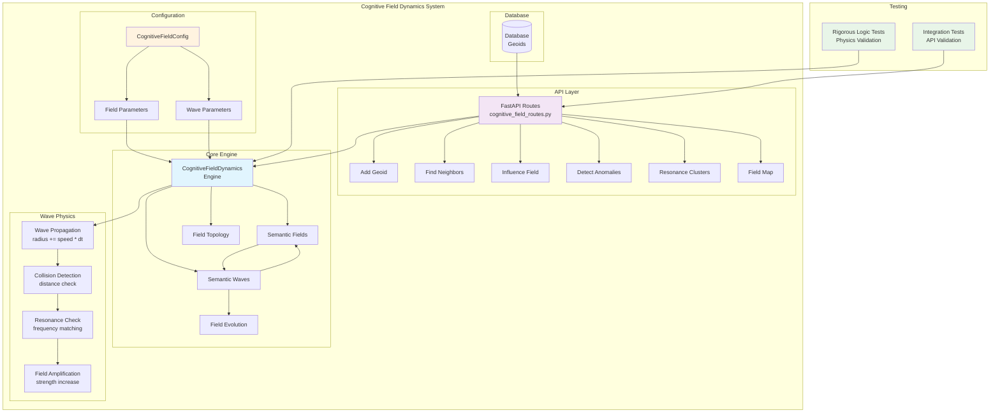

# Cognitive Field Dynamics Architecture

## Overview

The **Cognitive Field Dynamics (CFD)** engine represents a paradigm shift from traditional semantic similarity algorithms (kNN/RkNN) to a physics-inspired approach that models semantic relationships as dynamic fields with wave propagation.

## System Architecture Diagram



## Theoretical Foundation

### Core Concept
Semantic entities ("geoids") exist as point sources in a multidimensional semantic field. Each geoid:
- Emits **semantic waves** that propagate through the field
- Has intrinsic properties: **resonance frequency**, **phase**, and **field strength**
- Interacts with other geoids through wave interference and resonance

### Physical Analogies
- **Electromagnetic Fields**: Geoids act like charged particles creating fields
- **Wave Physics**: Semantic waves propagate at finite speed with amplitude decay
- **Resonance Theory**: Fields amplify when wave frequencies match their natural frequency

## System Components

### 1. SemanticField
```python
@dataclass
class SemanticField:
    geoid_id: str
    embedding: np.ndarray
    field_strength: float
    resonance_frequency: float
    phase: float
    decay_rate: float
```

**Properties:**
- **Embedding**: Normalized position in semantic space
- **Resonance Frequency**: Calculated from FFT of embedding
- **Phase**: Derived from embedding asymmetry
- **Field Strength**: Dynamic property that can be amplified by resonant waves

### 2. SemanticWave
```python
@dataclass
class SemanticWave:
    origin_id: str
    wavefront: np.ndarray
    amplitude: float
    wavelength: float
    propagation_speed: float
    radius: float
    visited_geoids: Set[str]
```

**Wave Physics:**
- **Radius Expansion**: `radius += propagation_speed * dt`
- **Amplitude Decay**: `amplitude *= exp(-decay_rate * dt * radius)`
- **Collision Detection**: `abs(distance_to_field - wave_radius) <= wave_thickness`

### 3. Wave Propagation Algorithm

```python
async def _process_wave_interactions(self, wave: SemanticWave):
    for geoid_id, field in self.fields.items():
        if geoid_id in wave.visited_geoids:
            continue
            
        distance = np.linalg.norm(wave.wavefront - field.embedding)
        
        # Check if wave hits field
        if abs(distance - wave.radius) <= self.config.wave_params.WAVE_THICKNESS:
            wave_strength = wave.amplitude * exp(-distance / wave.wavelength)
            
            # Check for resonance
            if abs(wave.wavelength - 2π / field.resonance_frequency) < threshold:
                field.field_strength += wave_strength * resonance_effect
                
            wave.visited_geoids.add(geoid_id)
```

## Key Innovations

### 1. True Wave Propagation
Unlike traditional approaches where interactions are instantaneous, CFD implements:
- **Finite propagation speed**: Waves take time to reach distant fields
- **Physical collision detection**: Fields only interact when wavefront passes through them
- **Causal relationships**: Temporal ordering of interactions matters

### 2. Dynamic Relationships
- **Adaptive field strengths**: Resonant interactions strengthen fields
- **Emergent clustering**: Groups form naturally through resonance patterns
- **Temporal dynamics**: Relationships evolve over time

### 3. Configurable Physics
All "magic numbers" externalized to `cognitive_field_config.py`:
```python
@dataclass
class WaveParameters:
    PROPAGATION_SPEED: float = 1.0
    WAVE_THICKNESS: float = 0.1
    AMPLITUDE_DECAY_RATE: float = 0.1
    INTERACTION_STRENGTH_THRESHOLD: float = 0.1
    RESONANCE_EFFECT_STRENGTH: float = 0.1
```

## Applications

### 1. Semantic Neighbor Discovery
Replaces kNN with dynamic field interactions:
```python
neighbors = cfd.find_semantic_neighbors(geoid_id, energy_threshold=0.1)
```

### 2. Influence Field Mapping
Continuous alternative to RkNN:
```python
influence_map = cfd.find_influence_field(geoid_id)
```

### 3. Resonance Clustering
Natural grouping by frequency patterns:
```python
clusters = cfd.find_semantic_clusters_by_resonance()
```

### 4. Anomaly Detection
Identifies semantic inconsistencies:
```python
anomalies = cfd.detect_semantic_anomalies()
```

## Performance Characteristics

### Computational Complexity
- **Wave propagation**: O(n) per time step, where n = number of fields
- **Collision detection**: O(n²) for wave-field interactions
- **Memory usage**: Linear in number of active waves and fields

### Optimization Strategies
- **Amplitude cutoff**: Removes weak waves to reduce computation
- **Spatial indexing**: Could be added for large-scale deployments
- **Parallel processing**: Wave interactions are naturally parallelizable

## Configuration Parameters

### Field Parameters
- `DEFAULT_FIELD_STRENGTH`: Initial strength of new fields
- `DEFAULT_DECAY_RATE`: Natural field decay over time
- `RESONANCE_FREQUENCY_EMBEDDING_SLICE`: FFT slice for frequency calculation
- `PHASE_EMBEDDING_SPLIT_FACTOR`: Embedding split point for phase calculation

### Wave Parameters
- `PROPAGATION_SPEED`: How fast waves expand through space
- `WAVE_THICKNESS`: Collision detection tolerance
- `AMPLITUDE_DECAY_RATE`: How quickly waves fade
- `AMPLITUDE_CUTOFF`: Minimum amplitude before wave removal
- `INTERACTION_STRENGTH_THRESHOLD`: Minimum strength for field interaction
- `RESONANCE_EFFECT_STRENGTH`: Amplification factor for resonant interactions

## Testing and Validation

### Rigorous Logic Tests
1. **Interaction Symmetry**: Mutual field interactions are symmetric
2. **Resonance Amplification**: Resonant fields strengthen over time
3. **Wave Propagation**: Waves only affect fields they physically reach
4. **Geoid Management**: Proper field creation and normalization

### Integration Tests
- API endpoint functionality
- Database integration
- Error handling
- JSON serialization

## Future Enhancements

### Potential Improvements
1. **3D Visualization**: Real-time field visualization
2. **Adaptive Parameters**: Self-tuning based on field behavior
3. **Quantum Effects**: Superposition and entanglement analogies
4. **Memory Optimization**: Efficient storage for large semantic spaces
5. **Distributed Processing**: Multi-node field computation

### Research Directions
1. **Cognitive Validation**: Compare with human semantic processing
2. **Benchmark Studies**: Performance vs. traditional methods
3. **Domain Applications**: Specialized configurations for different domains
4. **Emergent Behavior**: Study of complex field dynamics

## Conclusion

Cognitive Field Dynamics represents a conceptually honest approach to semantic processing that:
- **Respects causality** through finite propagation speeds
- **Enables emergence** through resonance and interference
- **Provides interpretability** through physical analogies
- **Supports evolution** through dynamic field adaptation

This architecture forms the foundation for advanced semantic understanding in the Kimera SWM system. 