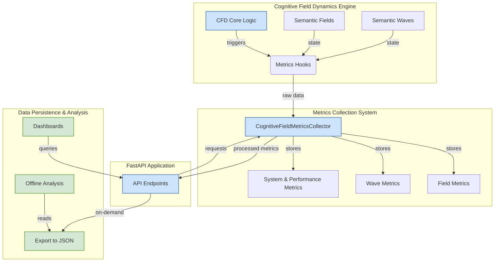
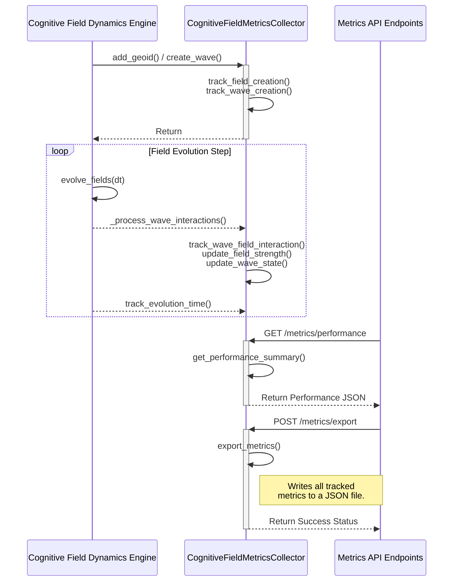
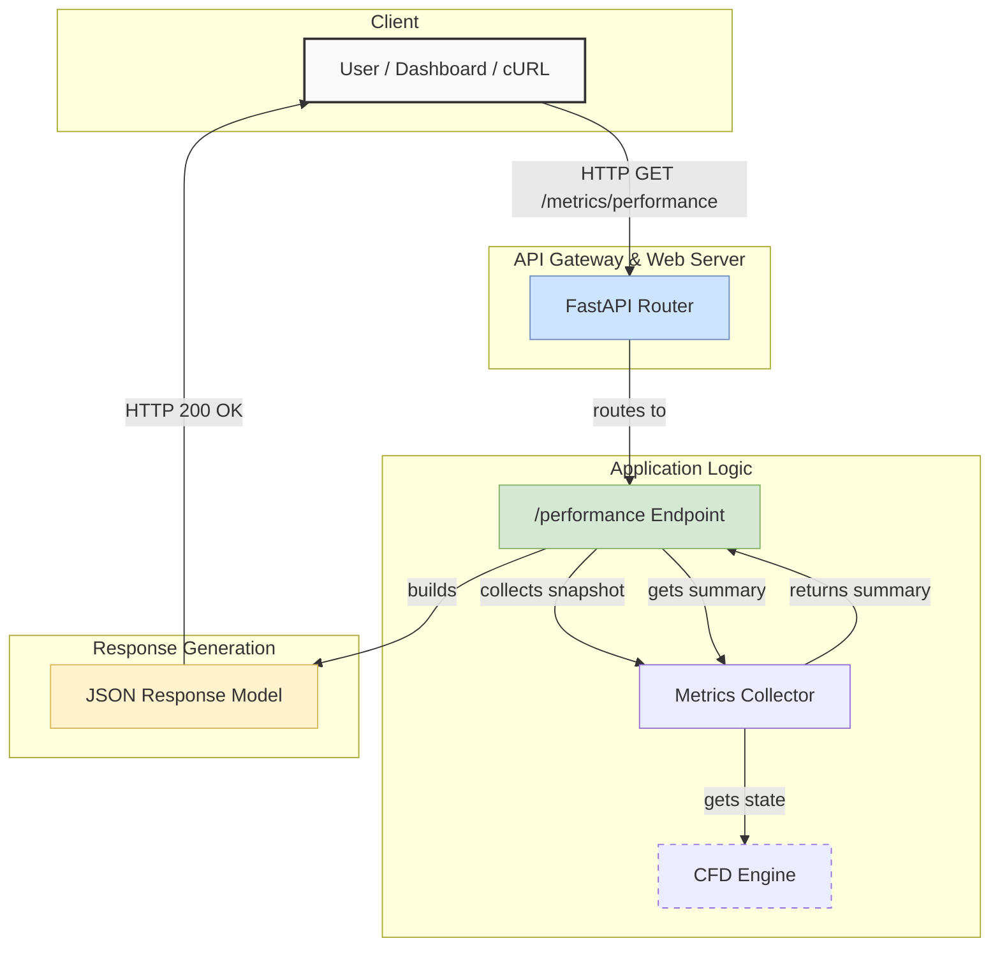

# Cognitive Field Dynamics: Metrics & Monitoring Architecture

This document provides a detailed architectural overview of the Cognitive Field Dynamics (CFD) Metrics and Monitoring system. It covers the system's architecture, data workflows, component interactions, and the underlying design principles that enable real-time performance tracking and analysis.

## 1. System Architecture

The metrics system is designed as a non-invasive, loosely-coupled component that hooks into the core CFD engine. This ensures that the core physics and semantic processing logic remains independent of the monitoring implementation, while still providing deep, real-time insights.

### High-Level Architectural Diagram

The following diagram illustrates the primary components and their interactions:

**Component Descriptions:**

-   **CFD Engine**: The core system responsible for simulating semantic field and wave dynamics. It contains hooks at critical processing points (e.g., field creation, wave interaction) to emit data.
-   **Metrics Collector**: A singleton service that receives raw event data from the engine. It processes this data, updating its internal state which includes detailed metrics for every field and wave, as well as aggregated performance statistics.
-   **API Endpoints**: A set of FastAPI routes that expose the collected metrics. These endpoints provide access to both raw and summarized data, catering to different use cases like dashboards, alerting, and manual inspection.
-   **Persistence & Analysis**: While the system primarily operates in-memory for performance, it provides an API endpoint to export the complete metrics snapshot to a JSON file for offline analysis, historical archiving, or populating other data stores.

## 2. Data Workflows & Pipelines

### Metrics Collection Workflow

The collection process is event-driven, triggered by actions within the CFD engine. This ensures that metrics are captured in real-time as the system state evolves.

**Workflow Steps:**

1.  **Initialization**: When a `SemanticField` or `SemanticWave` is created in the engine, a corresponding tracking method (`track_field_creation`, `track_wave_creation`) is called on the `CognitiveFieldMetricsCollector`.
2.  **Evolution Loop**: During each `evolve_fields` cycle, the engine reports key events:
    -   Wave-field interactions and resonance events.
    -   Changes in field strength or wave amplitude.
    -   The total time taken for the evolution step.
3.  **Data Aggregation**: The collector updates its internal data structures—dictionaries and deques—that hold the current state and historical performance data.
4.  **API Access**: External clients can query the metrics data via the API, which reads directly from the collector's in-memory store.
5.  **Export**: A client can trigger an export, which serializes the collector's entire state into a structured JSON file.

### API Request Pipeline

This diagram shows the lifecycle of an API request for metrics data.

## 3. Semantic Field Topology

In the context of Cognitive Field Dynamics, **topology** refers to the emergent relational structure of the semantic space. It's not just about the spatial position of fields but about their dynamic relationships based on resonance, influence, and interaction strength.

The `FieldTopology` class in the engine is designed to track these higher-order structures. While its implementation is currently a placeholder for future enhancement, its architectural purpose is to enable analysis of:

-   **Semantic Adjacency**: Which fields are "close" based on interaction potential, not just Euclidean distance. This is captured in the `find_semantic_neighbors` function.
-   **Critical Points**: Fields that act as major hubs of influence, identified by high field strength and numerous strong interactions. Anomalies in field strength can be an indicator of such points.
-   **Vortices & Sinks**: Areas where semantic energy is either rapidly circulating or being absorbed. This can be analyzed by tracking the total energy received by fields.
-   **Resonance Clusters**: Groups of fields that are strongly coupled due to similar resonance frequencies. This is a primary method for emergent structure detection and is implemented in the `find_semantic_clusters_by_resonance` function.

The metrics system provides the raw data necessary to analyze this topology. For example, by analyzing the `wave_interactions` and `total_energy_received` from the `FieldMetrics`, one can map out the flow of semantic energy and identify key topological features.

## 4. Design Principles

-   **Performance**: The metrics collection is designed to be extremely lightweight to minimize its impact on the core engine's performance. It uses efficient data structures and avoids blocking operations.
-   **Decoupling**: The collector is decoupled from the engine. The engine emits data without knowledge of how it's being used, allowing for different monitoring strategies to be swapped in without changing the core logic.
-   **Real-time Access**: Data is available for query in real-time, enabling live dashboards and immediate feedback on system state.
-   **Comprehensiveness**: The system aims to capture all key aspects of the CFD simulation, from high-level performance aggregates down to the state of individual fields and waves.
-   **Extensibility**: The architecture makes it straightforward to add new metrics or tracking capabilities as the CFD engine evolves. 