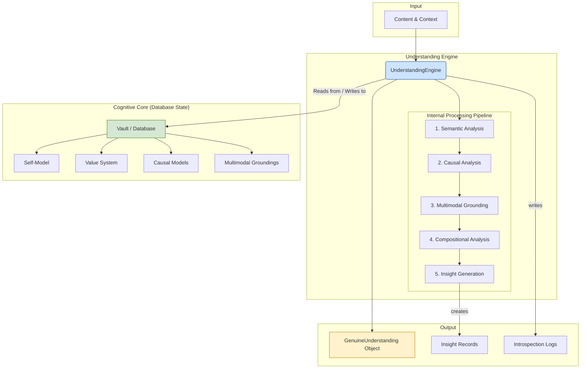
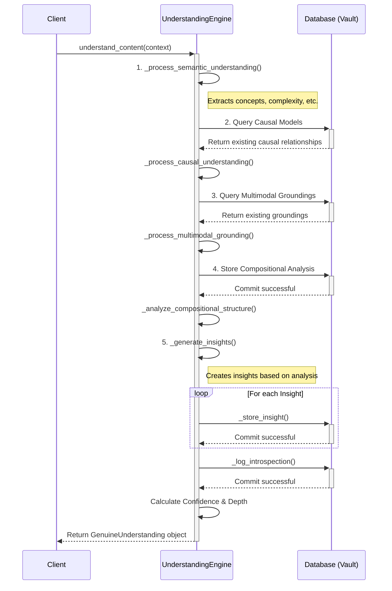

# Understanding Engine: Architecture

This document details the architecture of the **Understanding Engine**, a core component of the Kimera SWM system responsible for simulating a process of genuine understanding.

## 1. Architectural Goals

The Understanding Engine is designed to move beyond surface-level pattern matching and statistical correlation. Its primary goals are to:
-   **Model a Cognitive Process**: Simulate a multi-stage cognitive workflow for analyzing and integrating information.
-   **Integrate Multiple Facets of Understanding**: Combine semantic, causal, structural, and self-referential analysis.
-   **Maintain State**: Ground its understanding in a persistent state, including a model of itself, its values, and its knowledge.
-   **Generate Novel Insights**: Produce emergent conclusions based on its analysis, rather than just summarizing input.
-   **Enable Introspection**: Log its own reasoning process to allow for later analysis and self-correction.

## 2. High-Level Architecture

The engine functions as a central orchestrator that processes input content through an internal pipeline. It constantly interacts with the **Vault (database)**, which acts as its long-term memory and cognitive foundation.

### Key Components:

-   **UnderstandingEngine**: The main orchestrator class. It manages the processing pipeline and state.
-   **Internal Processing Pipeline**: A sequence of analytical steps applied to the input content. Each step builds upon the output of the previous one.
-   **Cognitive Core (Vault)**: The database represents the engine's foundational state. This is not just data storage; it is the AI's long-term memory, containing its beliefs, values, and self-concept.
    -   **Self-Model**: A database record of the AI's own capabilities, limitations, and knowledge domains.
    -   **Value System**: A set of core principles (e.g., harm prevention, truthfulness) that can guide reasoning.
    -   **Causal Models**: A collection of known cause-and-effect relationships.
    -   **Multimodal Groundings**: Links between abstract concepts and their physical or sensory properties.
-   **Output**: The engine produces a structured `GenuineUnderstanding` object, along with new `Insight` and `IntrospectionLog` records that are persisted in the Vault.

## 3. Data Flow and Processing Pipeline

The core logic resides in the `understand_content` method, which executes a precise sequence of operations.

### `understand_content` Workflow

### Pipeline Stage Descriptions:

1.  **Semantic Understanding**: This initial stage performs a surface-level semantic analysis of the input text. It calculates complexity, identifies key concepts, and generates a vector embedding.
2.  **Causal Understanding**: The engine queries its database of known causal relationships. It then attempts to match concepts from the input text to these models to identify potential cause-and-effect structures within the content.
3.  **Multimodal Grounding**: This stage attempts to "ground" the concepts in the text by linking them to non-textual information stored in the `MultimodalGroundingDB`. This is a crucial step for moving beyond abstract symbol manipulation.
4.  **Compositional Structure Analysis**: The engine analyzes the syntactic structure of the content, such as sentence count and length. This provides a measure of the content's structural complexity.
5.  **Insight Generation**: This is the synthesis step. Based on the outputs of the previous stages, the engine generates new, atomic pieces of information called "insights." For example, it might generate an insight that the text has "High semantic complexity" or that it found a "Causal structure." These insights are then stored in the `InsightDB`.
6.  **Introspection & Finalization**: The engine logs a record of its own process (`IntrospectionLogDB`) and calculates final metrics for `confidence_score` and `understanding_depth`, providing crucial metadata about the quality of its own processing.

## 4. Key Data Structures

-   **`UnderstandingContext` (Input)**: A dataclass that bundles all necessary inputs for the understanding process, including the raw content, processing goals, and confidence thresholds.
-   **`GenuineUnderstanding` (Output)**: A dataclass that represents the final, multi-faceted output. It contains the results of each pipeline stage, the final scores, and a list of generated insight IDs.
-   **Database Models (State)**: The various `...DB` models defined in `enhanced_database_schema.py` are the most critical data structures, as they form the persistent cognitive substrate of the engine.

## 5. Design Principles

-   **Stateful Cognition**: The engine's reasoning is not stateless. Its understanding of new content is explicitly dependent on its pre-existing, persistent state (self-model, values, causal knowledge).
-   **Orchestration, not Monolith**: The engine is primarily an orchestrator. The detailed logic for each step (e.g., embedding, database interaction) is handled by dedicated utilities and modules, keeping the engine's code focused on the high-level cognitive workflow.
-   **Emergent Insight**: Insights are not directly extracted but are *generated* as a result of the entire analytical process. This models insight as an emergent property of understanding.
-   **Quantified Confidence**: The engine does not simply output an answer; it outputs a `confidence_score` and `understanding_depth`, providing crucial metadata about the quality of its own processing. 