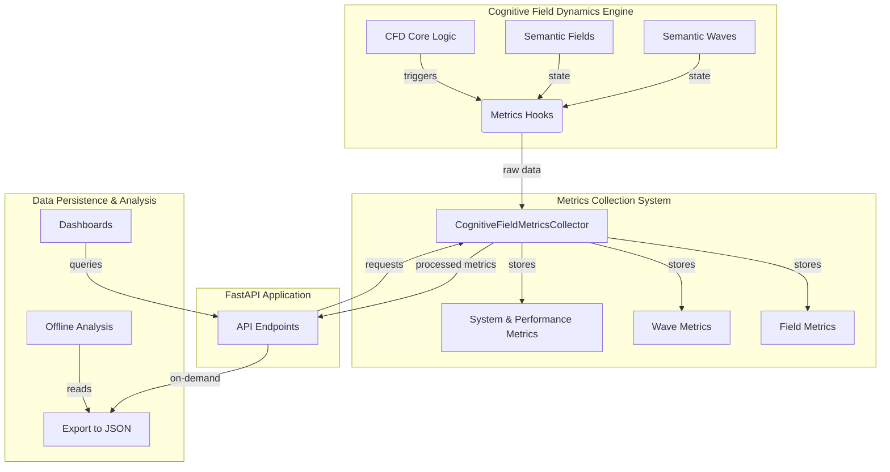

# User Guide: Cognitive Field Dynamics Metrics System

## 1. Overview

Welcome to the user guide for the Cognitive Field Dynamics (CFD) Metrics System. This guide provides practical information on how to use the monitoring and analytics features of the CFD engine. You will learn how to access performance data, interpret metrics, and leverage the API for your own analysis and applications.

This system allows you to:
-   **Monitor** the real-time health and performance of the CFD engine.
-   **Analyze** the behavior of semantic fields and waves.
-   **Diagnose** performance bottlenecks.
-   **Export** detailed metrics data for offline research and analysis.

### System Architecture Diagram


## 2. Accessing Metrics via API

The primary way to interact with the metrics system is through its REST API. All metrics endpoints are available under the `/cognitive-fields/metrics/` prefix.

### 2.1. Performance Summary

This is the main endpoint for getting a high-level overview of the system's performance.

-   **Endpoint**: `GET /cognitive-fields/metrics/performance`
-   **Description**: Returns a comprehensive summary including system overview, timing statistics, and aggregated field/wave metrics.
-   **cURL Example**:
    ```bash
    curl -X GET "http://localhost:8000/cognitive-fields/metrics/performance"
    ```
-   **Response Body**:
    ```json
    {
      "timestamp": 1750227272.381,
      "system_status": "operational",
      "metrics": {
        "system_overview": {
          "total_fields_created": 5,
          "total_waves_created": 5,
          "total_resonance_events": 0,
          "total_collisions": 0
        },
        "timing_metrics": { /* ... */ },
        "field_metrics": { /* ... */ },
        "wave_metrics": { /* ... */ }
      }
    }
    ```

### 2.2. Real-time System Snapshot

For live monitoring, this endpoint provides the most recent snapshot of the system's state.

-   **Endpoint**: `GET /cognitive-fields/metrics/system`
-   **Description**: Returns key real-time indicators like active field/wave counts, memory usage, and the latest performance measurements.
-   **cURL Example**:
    ```bash
    curl -X GET "http://localhost:8000/cognitive-fields/metrics/system"
    ```
-   **Response Body**:
    ```json
    {
      "timestamp": 1750227272.381,
      "total_fields": 5,
      "active_waves": 5,
      "evolution_time": 0.5,
      "performance": {
        "evolution_step_duration_ms": 0.20,
        "wave_propagation_time_ms": 0.05,
        "memory_usage_mb": 0.0098
      }
    }
    ```

### 2.3. Detailed Field Metrics

To dive deep into the state of individual semantic fields.

-   **Endpoint**: `GET /cognitive-fields/metrics/fields`
-   **Description**: Returns detailed metrics for every tracked semantic field, including strength, resonance frequency, and interaction history.
-   **cURL Example**:
    ```bash
    curl -X GET "http://localhost:8000/cognitive-fields/metrics/fields"
    ```

### 2.4. Detailed Wave Metrics

To analyze the behavior of propagating semantic waves.

-   **Endpoint**: `GET /cognitive-fields/metrics/waves`
-   **Description**: Returns detailed metrics for every active and recently decayed wave, including amplitude, radius, and energy transferred.
-   **cURL Example**:
    ```bash
    curl -X GET "http://localhost:8000/cognitive-fields/metrics/waves"
    ```

### 2.5. Exporting Metrics

For offline analysis, you can export the entire collection of metrics to a file.

-   **Endpoint**: `POST /cognitive-fields/metrics/export`
-   **Description**: Saves all currently held metrics data to a JSON file on the server.
-   **Parameters**:
    -   `filepath` (query, optional): The path and filename for the export. Defaults to `cognitive_field_metrics.json`.
-   **cURL Example**:
    ```bash
    curl -X POST "http://localhost:8000/cognitive-fields/metrics/export?filepath=my_analysis.json"
    ```

### 2.6. Resetting Metrics

To clear all collected data and start monitoring from a clean slate.

-   **Endpoint**: `POST /cognitive-fields/metrics/reset`
-   **Description**: Resets the metrics collector, clearing all historical data. Useful for isolating analysis to a specific time window.
-   **cURL Example**:
    ```bash
    curl -X POST "http://localhost:8000/cognitive-fields/metrics/reset"
    ```

## 3. Practical Workflows

### Workflow 1: Real-time Dashboarding

You can build a live dashboard by polling the `/metrics/system` and `/metrics/performance` endpoints periodically.

**Example (JavaScript)**:

```javascript
async function updateDashboard() {
    try {
        const response = await fetch('http://localhost:8000/cognitive-fields/metrics/performance');
        const data = await response.json();

        // Update UI elements with new data
        document.getElementById('field-count').innerText = data.metrics.field_metrics.active_fields;
        document.getElementById('wave-count').innerText = data.metrics.wave_metrics.active_waves;
        document.getElementById('avg-evo-time').innerText = data.metrics.timing_metrics.average_evolution_time_ms.toFixed(2) + ' ms';

    } catch (error) {
        console.error("Failed to fetch metrics:", error);
    }
}

// Poll for updates every 2 seconds
setInterval(updateDashboard, 2000);
```

### Workflow 2: Performance Tuning

Use the metrics to identify and diagnose performance issues.

1.  **Run a simulation** or your target workload.
2.  **Poll the `/metrics/performance` endpoint** and observe the `timing_metrics`.
3.  **Identify Bottlenecks**:
    -   If `average_evolution_time_ms` is high, the core simulation loop may be slow. This could be due to a very large number of fields or complex interactions.
    -   If a specific API endpoint shows high latency in `api_response_times`, investigate the logic for that endpoint.
4.  **Export Data**: After the run, `POST /metrics/export` to save a complete snapshot.
5.  **Analyze Offline**: Load the exported JSON into a script (e.g., Python with Pandas/Jupyter) to analyze trends. Look for correlations between high evolution times and the number of active waves or fields.

### Workflow 3: Scientific Analysis

The metrics system is a powerful tool for researching the emergent behavior of the Cognitive Field.

1.  **Set up an experiment**: Add a specific configuration of semantic fields.
2.  **Reset metrics**: `POST /metrics/reset` to ensure a clean data set.
3.  **Run the evolution**: Let the system evolve for a desired number of steps or duration.
4.  **Export the results**: `POST /metrics/export` to get a high-fidelity record of the experiment.
5.  **Analyze the data**:
    -   Track the `current_strength` of fields over time to see how energy is distributed.
    -   Analyze the `resonance_events` to understand how semantic concepts become coupled.
    -   Examine the `total_energy_transferred` by waves to map out influence pathways.

## 4. Understanding the Data Models

### Field Metrics
-   `field_id`: The unique identifier of the semantic field.
-   `initial_strength` vs `current_strength`: Shows how the field's energy has changed over time. A large increase indicates significant amplification through resonance.
-   `wave_interactions`: A raw count of how many waves have passed over this field.
-   `resonance_amplifications`: A count of how many of those interactions were resonant, leading to energy transfer.
-   `total_energy_received`: The cumulative energy this field has absorbed from waves.

### Wave Metrics
-   `origin_id`: The field that created this wave.
-   `current_amplitude`: The wave's current strength. This decays over time and distance.
-   `current_radius`: How far the wave has propagated from its origin.
-   `fields_visited`: How many fields this wave has interacted with.
-   `total_energy_transferred`: The cumulative energy this wave has imparted to fields it has resonated with.

This guide provides a starting point for using the CFD Metrics System. For more advanced use cases, refer to the detailed architecture documentation and the source code. 